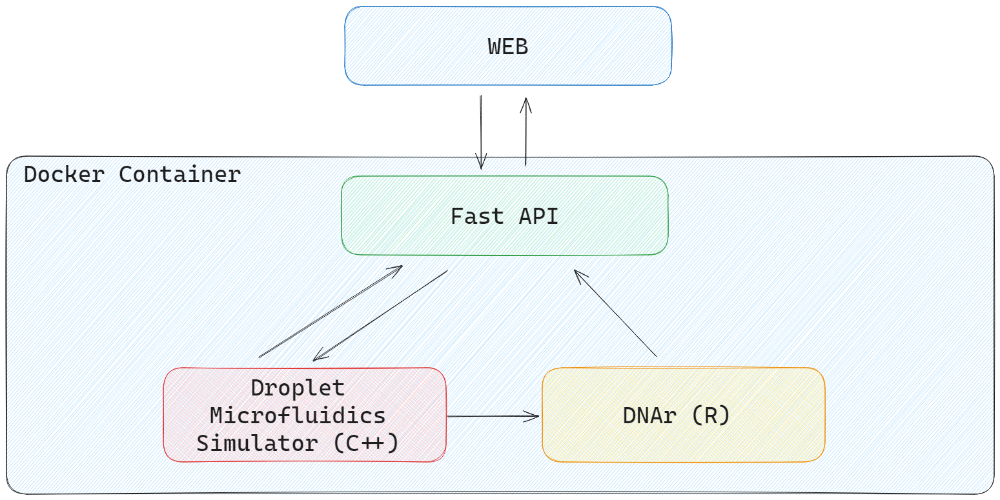

# DNA Microfluidics Simulator

## Project

Overview:
This project aims to develop an integrated simulator for molecular computing within droplet microfluidics environments. Molecular computing, utilizing chemical reaction networks (CRNs), offers promising avenues for computational tasks, but the challenge lies in controlling the reactions dynamically. Traditional CRNs lack the capability to introduce new chemical species during simulation, hindering their applicability in real-world scenarios. To address this limitation, we propose a solution leveraging droplet microfluidics.

Features:

CRN Integration: Accepts CRNs as input for simulating molecular reactions.
Droplet Management: Defines the composition and concentrations of chemical species within individual droplets.
Merge Time Specification: Allows users to specify when droplets merge, facilitating controlled reactions.
DNAr Integration: Utilizes DNAr, an R package, for designing and simulating formal CRNs and DNA-based reaction networks.
MMFT Droplet Simulator: Incorporates MMFT Droplet Simulator for simulating droplet movement and interactions within microfluidic biochips.
Heuristic Chip Design: Implements a heuristic algorithm to generate microfluidic biochip designs for efficient reaction control.
Validation: Utilizes MMFT Droplet Simulator to validate the generated chip designs.
Dynamic Species Addition: Sends merge time data to DNAr for dynamic addition of species during simulation.

Usage:

The software will be used to simulate CRN'S in a more realistic and easier to implement way. The software will provide the simulation data
for the circuits and also the Microfluidic Chip Design that can be used to control the reaction times.

The software will have a Web Online Tool to allow interested researchers and designers to quickly try proposed simulations. The tool will provide interactive grphs and visualizations of the simulation data.

Web Tool Architecture
